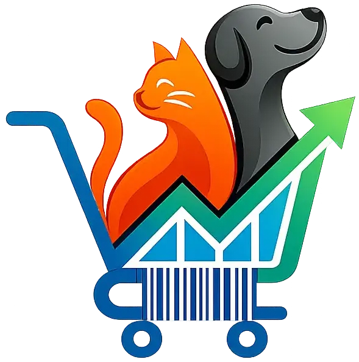
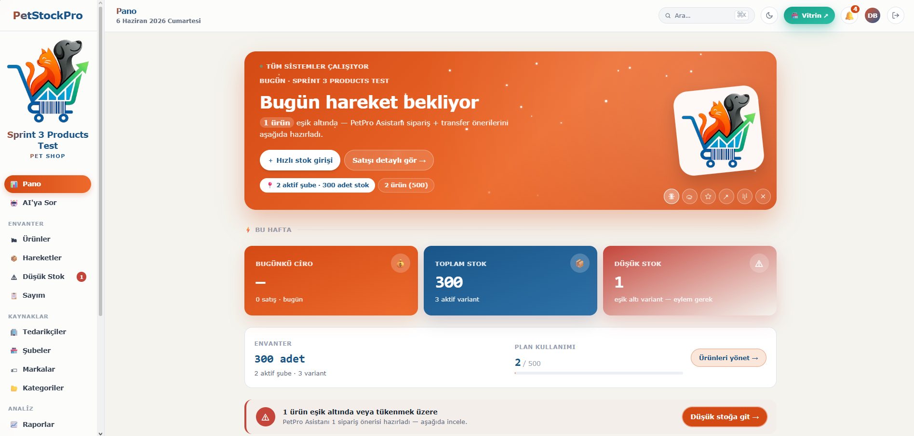
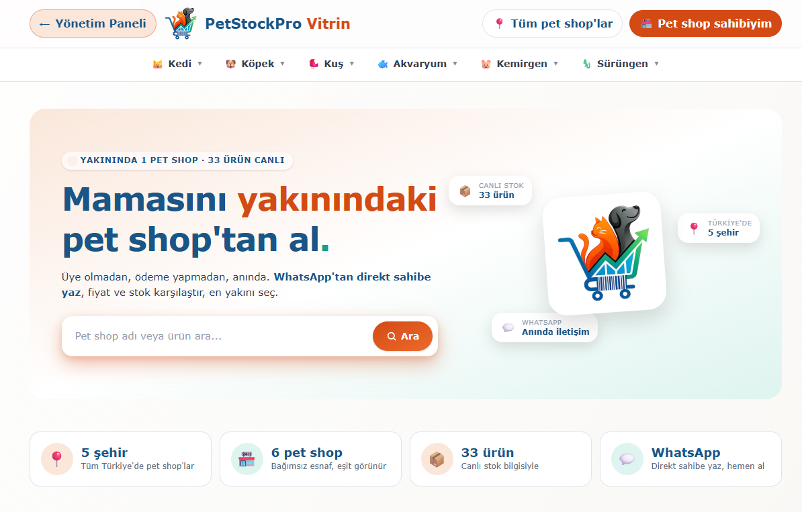
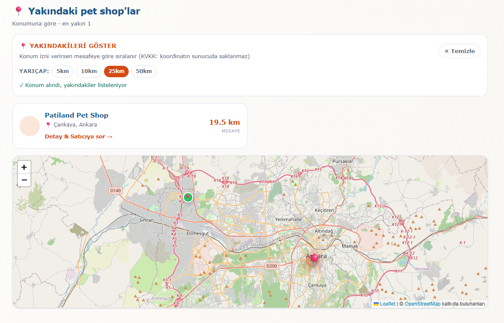

<div align="center">
  

  # PetStockPro

  **Multi-tenant inventory management + public storefront SaaS for pet shops in Turkey**

  [](https://nextjs.org)
  [](https://www.typescriptlang.org)
  [](./src)
  [](https://petstockpro.com)
  [](./LICENSE)

  [**Live Demo →**](https://petstockpro.com) &nbsp;·&nbsp; [**Admin Demo**](#demo)

</div>

---

## Overview

PetStockPro is a production-grade, multi-tenant SaaS platform built entirely by a solo developer. It gives pet shop owners a complete back-office: stock tracking, sales ledger, branch management, guided stocktake, supplier management, analytics, and a shared public storefront (similar to Google My Business — but pet-shop-first).

**Key stats:**
- 🏗 Built solo from scratch — schema, auth, payments, AI, deployment
- ✅ 1,782 tests passing (unit + integration)
- 🚀 Live in production at [petstockpro.com](https://petstockpro.com)
- 🤖 RAG-powered AI chatbot (Cloudflare Workers AI + Vectorize)
- 🔒 Full auth suite: 2FA TOTP, brute-force protection, email verification
- 💳 iyzico subscription billing + Nilvera e-invoice (Turkish e-Arşiv)

---

## Screenshots

> **[→ See it live at petstockpro.com](https://petstockpro.com)**

### Admin Dashboard

*KPI cards, low-stock alerts, AI assistant prompt, plan usage progress, activity feed*

### Public Storefront — Central Directory

*Cross-tenant product directory · WhatsApp deep-link CTA · city/category filtering · no signup required for buyers*

### Storefront — Nearby Pet Shops (Geolocation)

*Radius-based filtering (5/10/25/50 km) · Leaflet map · KVKK-compliant (coordinates never stored server-side)*

---

## Features

### 🏪 Inventory & Operations
- **Products & Variants** — multi-variant catalog (size, weight, etc.), per-branch stock thresholds, barcode support
- **Immutable Stock Ledger** — every movement (in/out/transfer/stocktake) is append-only with 24h reversal window
- **Guided Stocktake** — full-count workflow with per-item counted/diff tracking, auto-adjustments on completion
- **Branch Management** — unlimited branches, inter-branch transfers, per-branch inventory matrix
- **Supplier Management** — IBAN, payment terms, lead time, incoming stock totals
- **Low Stock Alerts** — per-variant threshold alerts, cross-branch transfer suggestions
- **Excel Import/Export** — bulk product import via `.xlsx`, 7 data exports (KVKK Art.11 compliant)

### 🌐 Public Storefront (`/vitrin`)
- Central directory listing (not per-tenant subdomain — think Google My Business)
- City/district filtering, product search, WhatsApp deep-link CTA
- Community feedback (emoji rating, anti-spam 1 IP × 1 tenant × 24h)
- Auto-unpublish when stock hits zero; manual re-publish toggle

### 🤖 AI Assistant (RAG)
- **Retrieval-Augmented Generation** over the full user manual (189 vector chunks)
- **Cloudflare Workers AI**: `@cf/baai/bge-m3` embeddings + `@cf/meta/llama-3.1-8b-instruct` inference
- **Cloudflare Vectorize** (1024-dim, cosine similarity) for semantic search
- Plan-gated: FREE plan gets 10 queries/day; rate-limited at 5/min per IP×user
- Streaming responses with markdown rendering + suggested questions

### 🔐 Authentication & Security
- **Email/password** + email verification (Brevo transactional)
- **2FA TOTP** — QR code + manual secret + 8 recovery codes (SHA-256 hashed, single-use)
- **Brute-force protection** — 5 fails → 1h lock; 3 locks → 24h permanent lock
- **Real-time UX** — remaining attempts banner, countdown timer on locked page
- Cloudflare Turnstile (CAPTCHA alternative) on register/forgot-password
- HIBP password breach check on register + reset
- Email change with dual-email verification + cancellation alert
- Session management, account lock Brevo email + Telegram critical alert

### 💳 Billing & Compliance
- **iyzico subscription** — webhook orchestrator (ORDER_SUCCESS / RENEWAL / FAILURE / CANCELED / EXPIRED)
- **Nilvera e-Arşiv** — Turkish e-invoice on every successful payment (VKN-based)
- Idempotent webhook processing (processed_webhooks dedup table)
- **Plan tiers**: FREE (50 products) · PRO (500, ₺1,000/mo) · PRO+ (unlimited, ₺2,000/mo)

### 📊 Analytics & Observability
- Reports: daily sales chart, top-selling variants, period summary (7/30/90 days)
- Audit log — every write action captured (`entity.action` pattern)
- System error tracking (custom `system_errors` table — no Sentry dependency)
- Log retention cron (configurable TTL per table via Cloudflare Workers cron)
- **Telegram alerts** — account locks, 2FA changes, error bursts, daily digest
- Superadmin panel — tenant KPIs, AI usage stats, error dashboard

### 🔔 Notifications
- In-app notification bell with unread badge
- Auto-triggered: low stock, stocktake completed, subscription events
- Bulk mark-read with optimistic UI (useSyncExternalStore + TanStack Query)

---

## Tech Stack

| Layer | Technology |
|---|---|
| **Framework** | [Next.js 16](https://nextjs.org) — App Router, React 19, Turbopack |
| **Language** | TypeScript 5 (strict mode) |
| **Database** | [Supabase](https://supabase.com) PostgreSQL (Frankfurt `eu-central-1`, KVKK compliant) |
| **ORM** | [Drizzle ORM](https://orm.drizzle.team) — 28 migrations, prepared statements |
| **Auth** | [Auth.js v5](https://authjs.dev) + custom 2FA layer via `otpauth` + `jose` |
| **UI** | [Tailwind CSS v4](https://tailwindcss.com) + [shadcn/ui](https://ui.shadcn.com) + Verdana design system |
| **State** | [TanStack Query v5](https://tanstack.com/query) + [Zustand v5](https://zustand-demo.pmnd.rs) |
| **Forms** | [React Hook Form](https://react-hook-form.com) + [Zod](https://zod.dev) |
| **Charts** | [Recharts](https://recharts.org) |
| **Maps** | [React Leaflet](https://react-leaflet.js.org) |
| **Animations** | [Motion (Framer)](https://motion.dev) |
| **AI** | Cloudflare Workers AI + Cloudflare Vectorize |
| **Email** | [Brevo](https://brevo.com) transactional API |
| **Payments** | [iyzico](https://iyzico.com) (TR) + [Nilvera](https://nilvera.com) e-Arşiv |
| **Storage** | Supabase Storage (R2-compatible, product images) |
| **Alerts** | Telegram Bot API |
| **Error tracking** | Custom `system_errors` table + Sentry (optional) |
| **Testing** | [Vitest](https://vitest.dev) + [Testing Library](https://testing-library.com) + [Playwright](https://playwright.dev) |
| **Deploy** | [Vercel](https://vercel.com) + [Cloudflare Workers](https://workers.cloudflare.com) (cron + AI + Vectorize) |
| **CDN/DNS** | Cloudflare (petstockpro.com) |
| **Excel** | [ExcelJS](https://exceljs.readthedocs.io) |

---

## Architecture

```
                    ┌─────────────────────────────────────┐
                    │        petstockpro.com               │
                    │   Next.js 16 (Vercel Edge/Node)      │
                    └──────────┬──────────────┬────────────┘
                               │              │
               ┌───────────────▼──┐    ┌──────▼──────────────┐
               │  Supabase Postgres│    │  Cloudflare Workers  │
               │  (Frankfurt EU)   │    │  - AI inference      │
               │  - 36+ tables     │    │  - Vectorize (RAG)   │
               │  - RLS policies   │    │  - Cron jobs         │
               │  - Realtime       │    │  - KV rate-limiting  │
               └───────────────────┘    └──────────────────────┘
                         │
        ┌────────────────┼────────────────┐
        ▼                ▼                ▼
   ┌─────────┐    ┌───────────┐    ┌──────────┐
   │  iyzico  │    │  Nilvera  │    │  Brevo   │
   │  billing │    │ e-invoice │    │  email   │
   └─────────┘    └───────────┘    └──────────┘
```

**Multi-tenancy model:** Each `company` has isolated data via `company_id` on every table + Supabase RLS policies. The `postgres` role bypasses RLS for server actions; `anon` role is default-deny.

**Stock ledger:** All movements are append-only (`stock_movements` table). Reversals create new records with `reverses_id` pointers — no mutation of history. Branch inventory (`branch_inventory`) is a denormalized projection maintained via transactional updates.

**AI pipeline:**
```
User query → bge-m3 embed → Vectorize top-5 → context assembly → LLaMA 3.1 8B → stream
```

---

## Project Structure

```
src/
├── app/
│   ├── admin/                  # Protected admin panel
│   │   ├── ai/                 # AI chatbot interface
│   │   ├── audit-log/          # Append-only audit viewer
│   │   ├── branches/           # Branch CRUD + inventory
│   │   ├── brands/             # Brand management
│   │   ├── categories/         # Category management
│   │   ├── low-stock/          # Threshold alerts + transfer suggestions
│   │   ├── notifications/      # In-app notification center
│   │   ├── products/           # Product + variant CRUD + storefront toggle
│   │   ├── reports/            # Sales analytics + charts
│   │   ├── settings/           # Company, account, security, export
│   │   ├── stock-movements/    # Immutable ledger + 4 drawers
│   │   ├── stocktake/          # Guided full-count workflow
│   │   ├── superadmin/         # Tenant management, system health
│   │   └── suppliers/          # Supplier CRUD
│   ├── vitrin/                 # Public storefront (central directory)
│   ├── api/
│   │   ├── ai/chat/            # RAG streaming endpoint
│   │   ├── webhooks/iyzico/    # Billing webhook handler
│   │   └── locations/          # Cities/districts for cascade selects
│   ├── login/ register/ onboarding/   # Auth flow
│   ├── 2fa-setup/ forgot-password/    # Auth extensions
│   └── fiyatlar/ iletisim/            # Public pages
│
├── lib/
│   ├── ai/                     # CF Vectorize client + RAG helpers
│   ├── auth/                   # 2FA, brute-force, email-change, sessions
│   ├── billing/                # iyzico orchestrator, Nilvera invoices
│   ├── bootstrap/              # Auto-seed on first boot
│   ├── cache/                  # React.cache() request-scoped helpers
│   ├── catalog/                # Products, variants, storefront validation
│   ├── errors/                 # System error tracking + threshold alerts
│   ├── notifications/          # Trigger logic + list queries
│   ├── reports/                # Sales + stocktake analytics
│   ├── stock/                  # Movements, reversals, inventory chain
│   ├── stocktake/              # Session + item count helpers
│   └── vitrin/                 # Public storefront queries
│
├── db/
│   ├── schema/                 # Drizzle table definitions (36 tables)
│   └── migrations/             # 28 SQL migrations
│
└── components/
    ├── ui/                     # shadcn/ui base components
    ├── chat-interface.tsx      # AI chatbot UI
    ├── notification-bell.tsx   # Real-time bell + badge
    └── pet-spinner.tsx         # Brand-consistent loading states
```

---

## Getting Started

### Prerequisites

- Node.js 22+
- A [Supabase](https://supabase.com) project (Frankfurt region recommended)
- A [Cloudflare](https://cloudflare.com) account (for AI + Vectorize + Workers)

### Setup

```bash
# 1. Clone & install
git clone https://github.com/yourusername/petstockpro
cd petstockpro
npm install --legacy-peer-deps

# 2. Configure environment
cp .env.example .env
# Fill in DATABASE_URL, SUPABASE_*, AUTH_SECRET, CF_*, etc.

# 3. Apply database migrations
npm run db:migrate

# 4. Seed initial data (cities, districts, catalog)
npm run db:seed

# 5. Start development server
npm run dev   # http://localhost:3000
```

### Environment Variables

| Variable | Description |
|---|---|
| `DATABASE_URL` | Postgres connection string (Supabase Transaction Pooler) |
| `SUPABASE_URL` | Supabase project URL |
| `SUPABASE_ANON_KEY` | Supabase anon key (public) |
| `SUPABASE_SERVICE_ROLE_KEY` | Service role key (server-side uploads) |
| `AUTH_SECRET` | Auth.js secret (32+ random chars) |
| `CF_ACCOUNT_ID` | Cloudflare account ID |
| `CF_API_TOKEN` | Cloudflare API token (Vectorize + AI access) |
| `CF_VECTORIZE_INDEX` | Vectorize index name |
| `BREVO_API_KEY` | Brevo transactional email |
| `TELEGRAM_BOT_TOKEN` | Telegram bot for alerts |
| `TELEGRAM_CHAT_ID` | Target chat/channel ID |
| `IYZICO_API_KEY` | iyzico API key |
| `IYZICO_SECRET_KEY` | iyzico secret key |
| `IYZICO_WEBHOOK_SECRET` | Webhook signature verification |
| `NILVERA_API_KEY` | Nilvera e-Arşiv API key |

---

## Commands

| Command | Description |
|---|---|
| `npm run dev` | Dev server with Turbopack + hot reload |
| `npm run build` | Production build |
| `npm run start` | Start production server |
| `npm run typecheck` | TypeScript type checking |
| `npm run lint` | ESLint |
| `npm run test` | Vitest watch mode |
| `npm run test:run` | Vitest single run (CI) |
| `npm run test:e2e` | Playwright end-to-end tests |
| `npm run test:coverage` | Coverage report |
| `npm run db:generate` | Generate Drizzle migration from schema changes |
| `npm run db:migrate` | Apply pending migrations |
| `npm run db:studio` | Drizzle Studio GUI |
| `npm run db:seed` | Seed cities, districts, default categories |

---

## Demo

The app is live at **[petstockpro.com](https://petstockpro.com)**.

To explore the admin panel, click **"Demo Bayi"** on the homepage — it opens a pre-loaded demo tenant with sample products, stock history, and the AI assistant.

---

## License

Proprietary. All rights reserved © 2026 PetStockPro.

This repository is public for portfolio purposes. The code is not licensed for reuse, redistribution, or commercial use.
